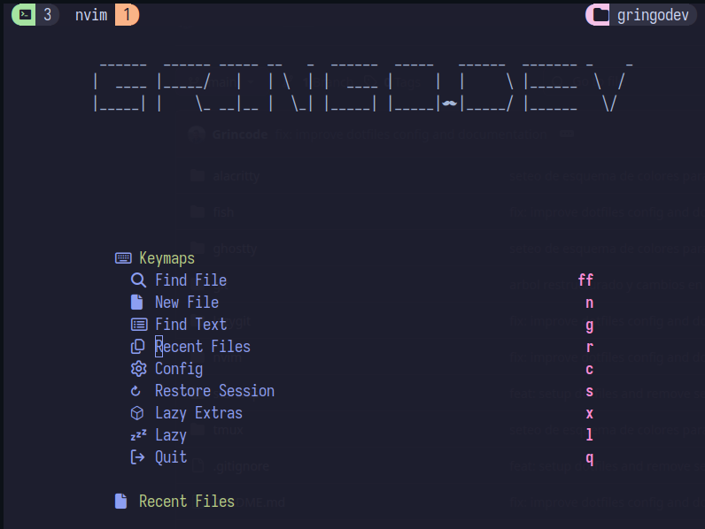

# Dotfiles

<p align="center">
  
  <br/>
  <em>nvim</em>
</p>

Configuración personal para un workflowDev optimal.

---

## 🚧 Instalador v2.0 (En Desarrollo)

> **Rama**: `feat/improved-install-script`  
> **Estado**: En desarrollo activo - Feedback bienvenido!

Nueva versión del instalador con:

- Instalación interactiva de aplicaciones via Homebrew
- Backup automático antes de sobrescribir configs
- Interfaz visual en terminal
- Múltiples modos: instalar apps, reinstalar symlinks, solo symlinks

### Probar la nueva versión

```bash
cd ~/dotfiles
git checkout feat/improved-install-script
./install.sh
```

### Cambios planned para v2.0

- [ ] Instalación de brew si no está presente
- [ ] Detección automática de apps instaladas
- [ ] Preguntar antes de cada symlink
- [ ] Modo verbose para debugging
- [ ] Verificación post-instalación

---

## Instalación (v1.0)

## Estructura

| Directorio   | Descripción            |
| ------------ | ---------------------- |
| `nvim/`      | Neovim (LazyVim-based) |
| `fish/`      | Fish shell config      |
| `tmux/`      | Tmux con plugins       |
| `starship/`  | Starship prompt        |
| `lazygit/`   | LazyGit config         |
| `alacritty/` | Alacritty terminal     |
| `ghostty/`   | Ghostty terminal       |

## Requisitos Previos

- Neovim >= 0.10
- Fish shell >= 3.0
- Tmux >= 3.0
- [LazyVim prerequisites](https://lazyvim.github.io/installation)

## Instalación

```bash
git clone <repo> ~/dotfiles
cd ~/dotfiles
./install.sh
```

El script symlinkea cada directorio a `~/.config/`.

## Post-Instalación

1. **Tmux**: Instalar TPM plugins (prefix + I)
2. **Fisher**: Plugins de fish se instalan automáticamente en primera sesión
3. **LazyVim**: Plugins se instalan automáticamente al abrir nvim

---

*Para la versión v2.0 (en desarrollo), el instalador maneja todo automáticamente.*
